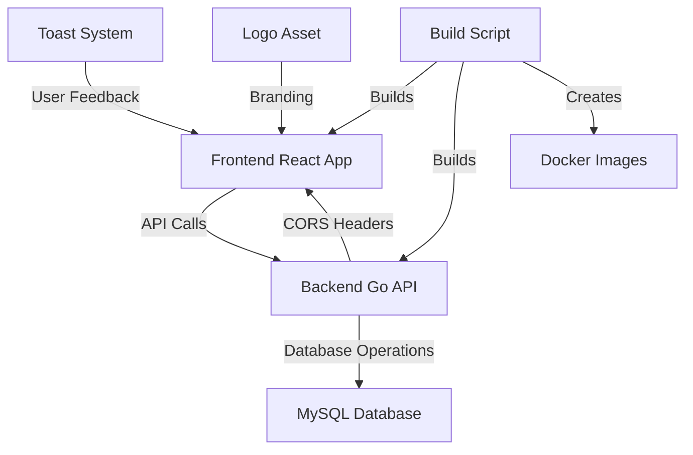
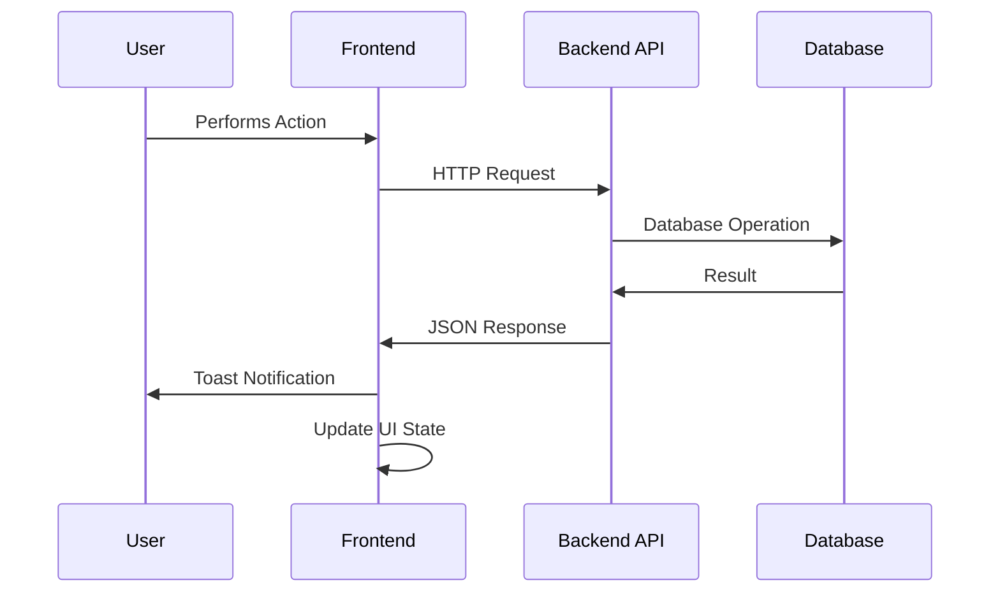

# Design Document

## Overview

This design document outlines the architecture and implementation approach for enhancing the coaching application with improved API integration, comprehensive feedback management, team administration, user experience enhancements, and streamlined build processes. The improvements will transform the application from a local storage-based system to a fully integrated frontend-backend solution with professional UI/UX features.

## Architecture

### System Integration Flow


### Data Flow Architecture


## Components and Interfaces

### Backend Enhancements

#### CORS Middleware Enhancement
The existing CORS middleware is already functional but will be verified to ensure proper frontend integration.

**Current Implementation Analysis:**
- ✅ Allows all origins (`*`)
- ✅ Supports all necessary HTTP methods
- ✅ Handles preflight OPTIONS requests
- ✅ Includes required headers

#### New API Endpoints
Building on existing feedback endpoints, we'll add team management capabilities:

```go
// New endpoints to add
DELETE /api/teams/:id/members/:memberId  // Remove member from team
DELETE /api/teams/:id                    // Delete entire team
GET /api/teams/:id/members              // Get team members
```

### Frontend Architecture Changes

#### API Service Layer
Create a centralized API service to replace local storage operations:

```typescript
interface ApiService {
  // Team Members
  createTeamMember(member: CreateTeamMemberRequest): Promise<TeamMember>
  getTeamMembers(): Promise<TeamMember[]>
  
  // Teams
  createTeam(team: CreateTeamRequest): Promise<Team>
  getTeams(): Promise<Team[]>
  deleteTeam(teamId: string): Promise<void>
  removeMemberFromTeam(teamId: string, memberId: string): Promise<void>
  
  // Feedback
  createFeedback(feedback: CreateFeedbackRequest): Promise<Feedback>
  getAllFeedback(): Promise<Feedback[]>
  getFeedbackByTeam(teamId: string): Promise<Feedback[]>
  getFeedbackByMember(memberId: string): Promise<Feedback[]>
  
  // Assignments
  assignMemberToTeam(assignment: AssignmentRequest): Promise<Assignment>
}
```

#### State Management Updates
Transform existing hooks to use API calls instead of local storage:

```typescript
// Updated hook signatures
export const useTeamMembers = () => {
  const [members, setMembers] = useState<TeamMember[]>([])
  const [loading, setLoading] = useState(false)
  const [error, setError] = useState<string | null>(null)
  
  // API-based operations
  const fetchMembers = async () => { /* API call */ }
  const addMember = async (member: CreateTeamMemberRequest) => { /* API call */ }
}
```

#### New Components

**Toast Notification System:**
```typescript
interface ToastProps {
  message: string
  type: 'success' | 'error' | 'info'
  duration?: number
  onClose: () => void
}

interface ToastContextType {
  showToast: (message: string, type?: 'success' | 'error' | 'info') => void
}
```

**Feedback List Page:**
```typescript
interface FeedbackListPageProps {
  // No props needed - manages its own state
}

interface FeedbackFilters {
  type: 'all' | 'team' | 'member'
  targetId?: string
}
```

**Team Management Page:**
```typescript
interface TeamManagementPageProps {
  // No props needed - manages its own state
}

interface TeamWithMembers {
  team: Team
  members: TeamMember[]
}
```

#### Logo Integration
Update the Navigation component to include logo display:

```typescript
interface NavigationProps {
  logoSrc?: string // Path to logo image
}
```

### New Pages and Routes

#### Updated Routing Structure
```typescript
// Additional routes to add
<Route path="/feedback-list" element={<FeedbackListPage />} />
<Route path="/team-management" element={<TeamManagementPage />} />
```

## Data Models

### Frontend Type Updates
Update existing types to match backend API responses:

```typescript
// Updated to match backend models
export interface TeamMember {
  id: number        // Changed from string to number
  name: string
  email: string
  picture?: string
  teams?: Team[]    // Populated by backend joins
}

export interface Team {
  id: number        // Changed from string to number
  name: string
  logo?: string
  members?: TeamMember[]  // Populated by backend joins
}

export interface Feedback {
  id: number        // Changed from string to number
  target_type: 'team' | 'member'  // Match backend field name
  target_id: number               // Match backend field name
  content: string
  created_at: string             // ISO timestamp from backend
}
```

### API Request/Response Models
```typescript
// Request models
export interface CreateTeamMemberRequest {
  name: string
  email: string
  picture?: string
}

export interface CreateTeamRequest {
  name: string
  logo?: string
}

export interface CreateFeedbackRequest {
  target_type: 'team' | 'member'
  target_id: number
  content: string
}

export interface AssignmentRequest {
  team_id: number
  team_member_id: number
}
```

## Error Handling

### API Error Handling Strategy
```typescript
interface ApiError {
  message: string
  status: number
  details?: any
}

class ApiService {
  private async handleResponse<T>(response: Response): Promise<T> {
    if (!response.ok) {
      const error: ApiError = {
        message: `HTTP ${response.status}: ${response.statusText}`,
        status: response.status
      }
      
      try {
        const errorData = await response.json()
        error.details = errorData
        error.message = errorData.error || error.message
      } catch {
        // Use default message if JSON parsing fails
      }
      
      throw error
    }
    
    return response.json()
  }
}
```

### User-Facing Error Messages
- Network errors: "Unable to connect to server. Please check your connection."
- Validation errors: Display specific field errors from backend
- Server errors: "Something went wrong. Please try again."
- Not found errors: "The requested item was not found."

## Testing Strategy

### Frontend Testing Approach
1. **Unit Tests**: Test individual components and hooks with mocked API calls
2. **Integration Tests**: Test API service layer with mock server responses
3. **E2E Tests**: Update existing tests to work with API integration

### Backend Testing Approach
1. **Unit Tests**: Test new handler methods and service functions
2. **Integration Tests**: Test API endpoints with test database
3. **CORS Testing**: Verify cross-origin requests work properly

### Test Data Management
- Use test fixtures for consistent API responses
- Mock API calls in component tests
- Use test database for backend integration tests

## Implementation Phases

### Phase 1: Backend API Enhancements
1. Add team management endpoints (delete team, remove member)
2. Verify CORS middleware functionality
3. Add comprehensive error handling
4. Update tests for new endpoints

### Phase 2: Frontend API Integration
1. Create API service layer
2. Update existing hooks to use API calls
3. Transform data models to match backend
4. Add loading states and error handling

### Phase 3: New UI Features
1. Implement toast notification system
2. Create feedback list page with filtering
3. Create team management page
4. Add logo to navigation header

### Phase 4: User Experience Enhancements
1. Add success toast notifications to all forms
2. Implement data loading on app startup
3. Add loading indicators throughout the app
4. Improve error messaging

### Phase 5: Build Process Enhancement
1. Create build-all.sh script
2. Test build process for all components
3. Verify Docker image creation
4. Document build process

## Security Considerations

### API Security
- Input validation on all endpoints
- Proper error messages that don't leak sensitive information
- Rate limiting considerations for production

### Frontend Security
- Sanitize user inputs before display
- Validate data received from API
- Handle authentication tokens securely (future enhancement)

## Performance Considerations

### Frontend Optimizations
- Implement proper loading states to improve perceived performance
- Cache API responses where appropriate
- Debounce search/filter operations
- Lazy load components where beneficial

### Backend Optimizations
- Use database joins to reduce API calls
- Implement proper indexing for filter operations
- Add pagination for large datasets (future enhancement)

## Deployment Considerations

### Environment Configuration
- API base URL configuration for different environments
- CORS origin configuration for production
- Database connection settings
- Build script environment variables

### Docker Integration
- Update Docker configurations if needed
- Ensure build script works in containerized environment
- Verify CORS settings work with Docker networking