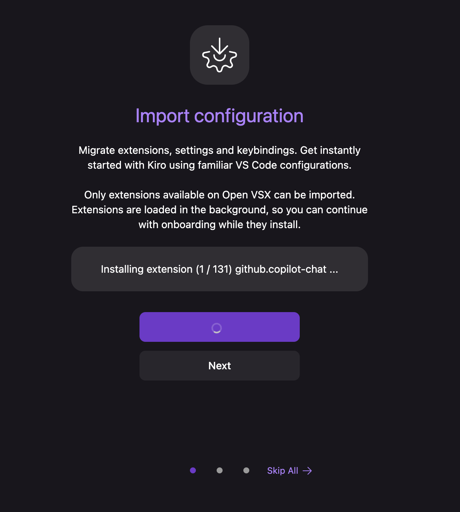
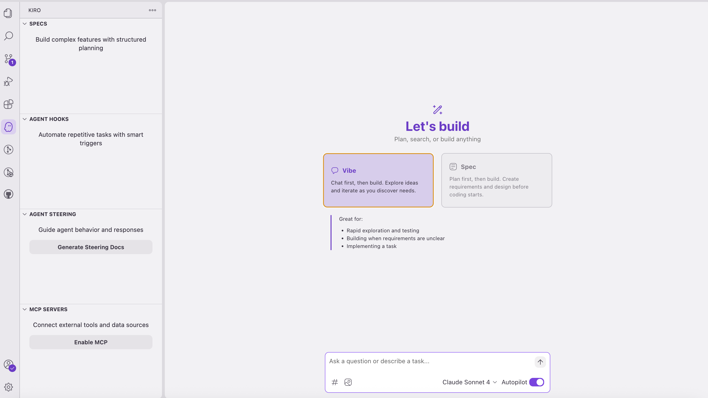
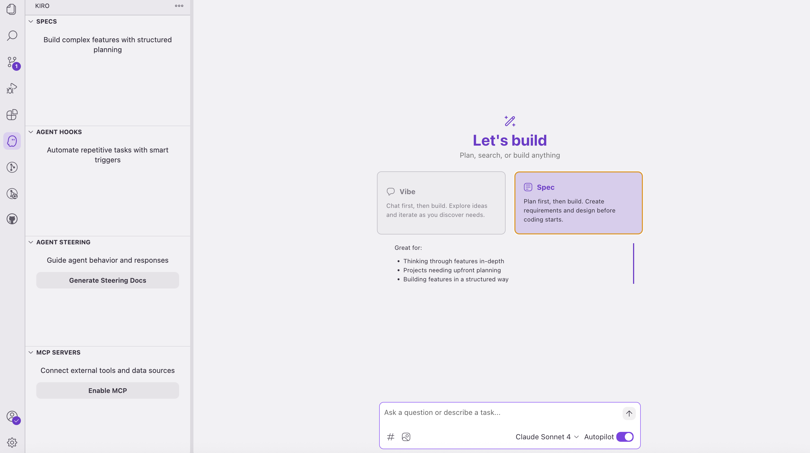
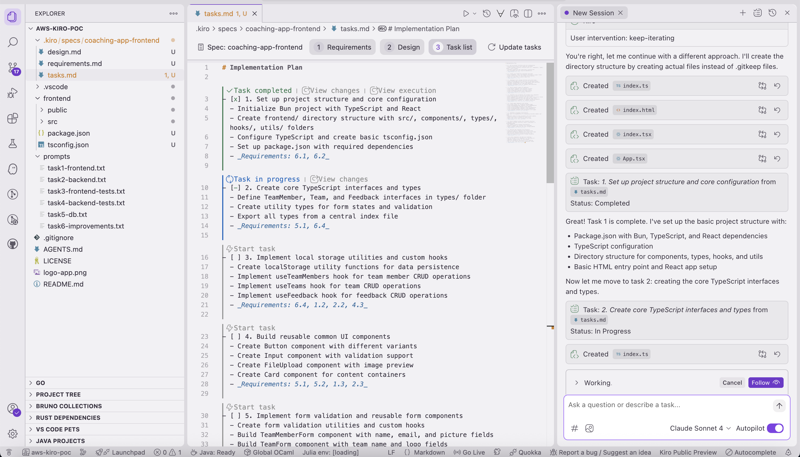
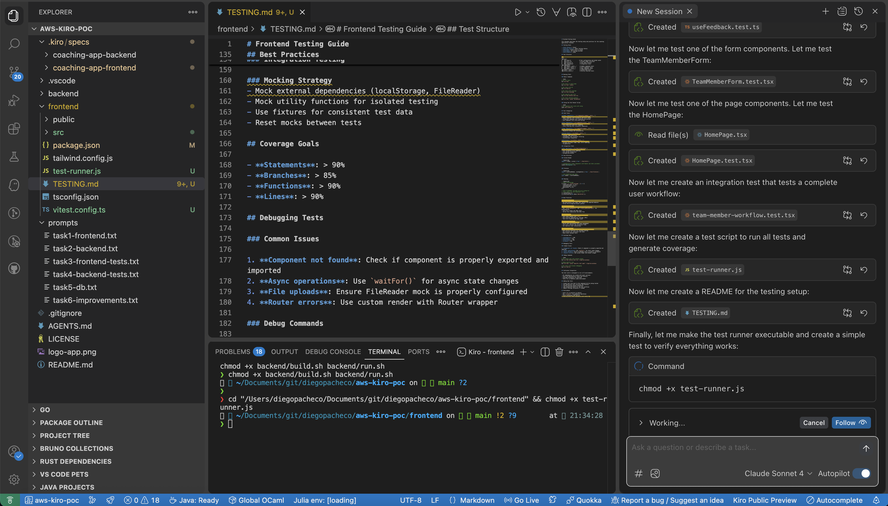
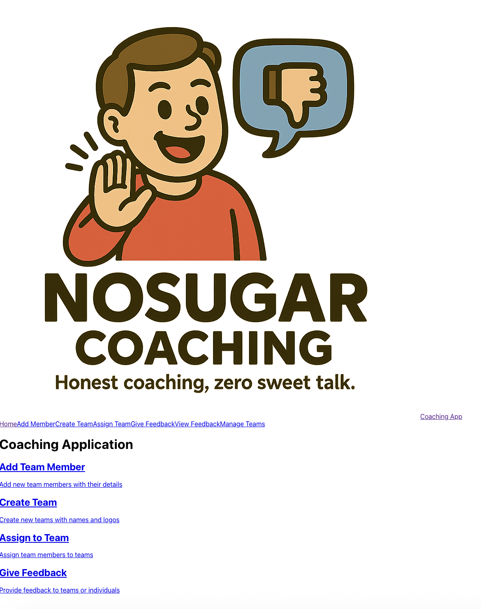
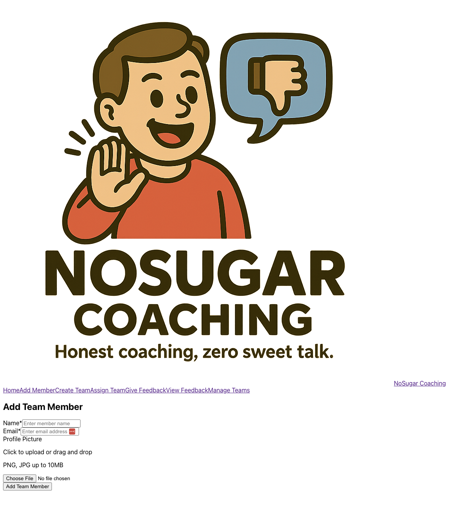
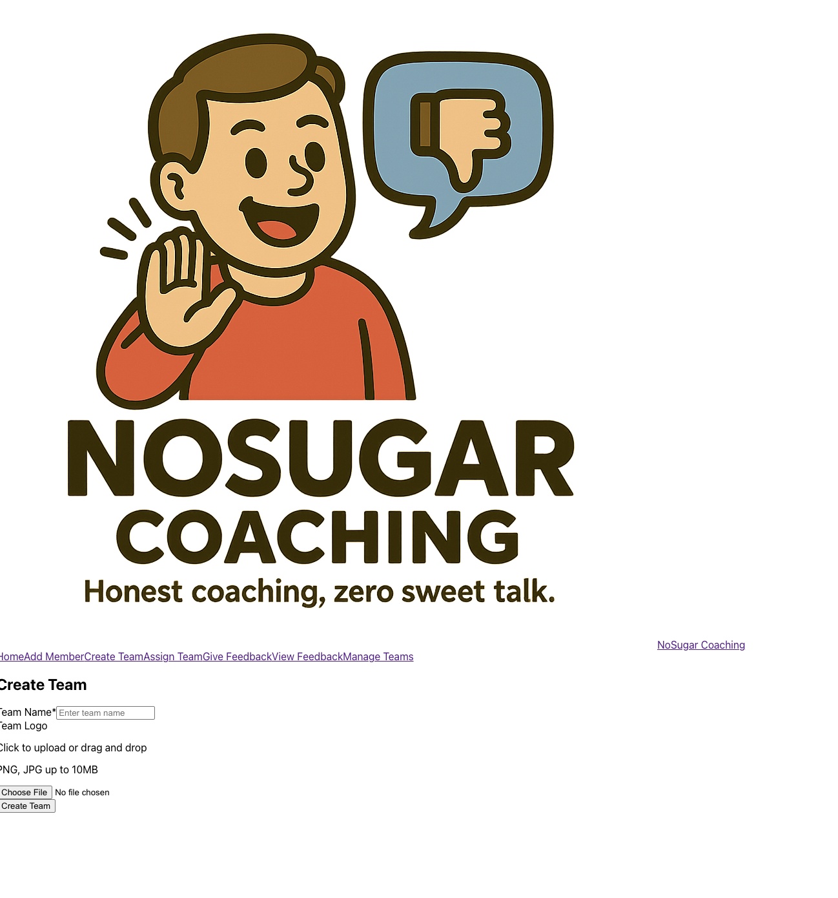
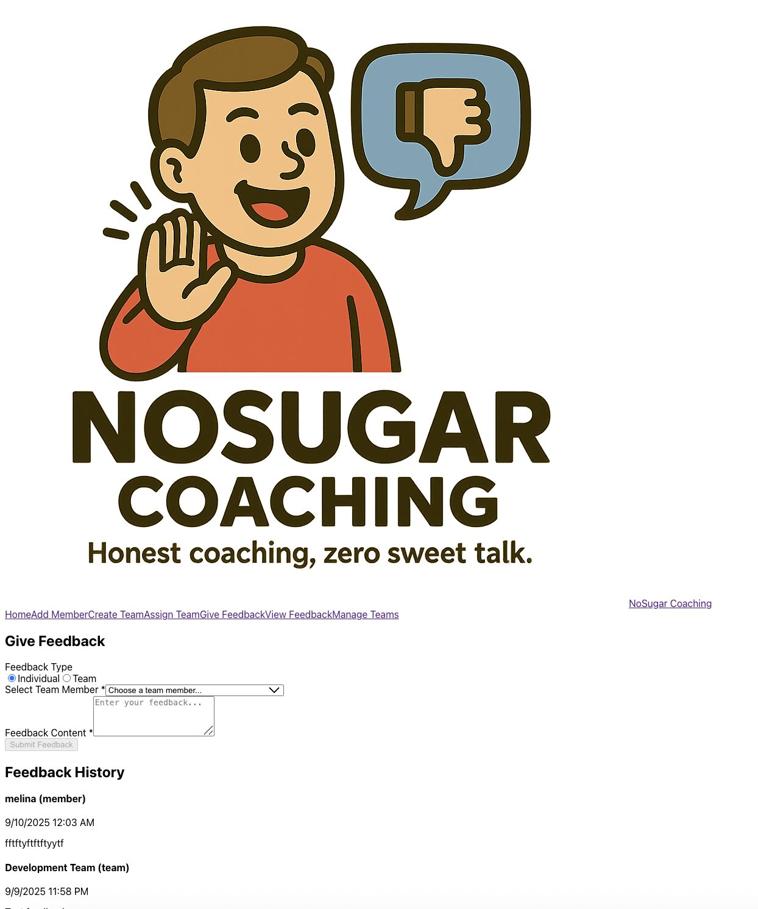

# Coaching Application

A full-stack coaching application built with React frontend, Go backend, and MySQL database, all containerized with Docker.

## Trade-off Analysis | Kiro POC Experience

PROS
* they have specs with requirements, design and tasks.
* I'ts a fork for VSCODE 
* You can import all your plugins from vscode
* It's fast
* It kind of works-ish


CONS
* VS Code import was anoying I had to agree to 92 plugins, and I had 131, IDK why he missed the others but is a bug in KIRO for sure.
* It produced a lot of bugs, much more than all other agents
* It shock a couple of time and could not get the commands running. I had to kill the terminals to guarantee it would not be sutck. Sometimes I had to tell kiro he was stuck. Clearly this is a bug in KIRO.
* The resulting UI is very bad, very ugly and barely works.
* It took me 4h and I could not get to the point I really wanted.
* Kiro VSCode crashed 1 time.
* 

## Results

Kiro Import of VS Code <BR/>
 <BR/>

Kiro In Action <BR/>
 <BR/>

Kiro In Action <BR/>
 <BR/>

Kiro In Action <BR/>
 <BR/>

Kiro In Action <BR/>
 <BR/>

Result APP 1 <BR/>
 <BR/>

Result APP 3 <BR/>
 <BR/>

Result APP 4 <BR/>
 <BR/>

Result APP 5 <BR/>
 <BR/>

Result APP 6 <BR/>
 <BR/>

Result APP 7 <BR/>
 <BR/>


## Quick Start

### Prerequisites
- Docker and Docker Compose installed
- Git

### Running the Application

1. Clone the repository:
```bash
git clone <repository-url>
cd aws-kiro-poc
```

2. Start the full stack:
```bash
./start.sh
```

3. Access the application:
- Frontend: http://localhost:3000
- Backend API: http://localhost:8080
- Health Check: http://localhost:8080/health

### Available Commands

```bash
./start.sh          # Start in development mode
./start.sh prod     # Start in production mode
./start.sh stop     # Stop all services
./start.sh restart  # Restart the stack
./start.sh status   # Show service status
./start.sh logs     # View logs
./start.sh cleanup  # Remove all data (destructive)
./start.sh help     # Show help
```

## Architecture

The application consists of three main services:

- **Frontend**: React application with Bun, served on port 3000
- **Backend**: Go API with Gin framework, served on port 8080
- **Database**: MySQL 9 with persistent data storage

## Development

### Environment Variables

The application uses the following environment variables:

- `DB_HOST`: Database host (default: database)
- `DB_PORT`: Database port (default: 3306)
- `DB_USER`: Database user (default: appuser)
- `DB_PASSWORD`: Database password (default: apppassword)
- `DB_NAME`: Database name (default: coaching_app)
- `SERVER_PORT`: Backend server port (default: 8080)
- `REACT_APP_API_URL`: Frontend API URL (default: http://localhost:8080/api)

### Database Schema

The database includes tables for:
- Teams
- Team Members
- Team Assignments (many-to-many)
- Feedback (polymorphic targeting)

### Data Persistence

Database data is persisted in `./db/mysql_data/` directory, which is excluded from version control.

## Production Deployment

For production deployment:

```bash
./start.sh prod
```

This uses optimized Docker images and production configurations.

## Troubleshooting

- Check service status: `./start.sh status`
- View logs: `./start.sh logs`
- Restart services: `./start.sh restart`
- Clean reset: `./start.sh cleanup`

### Related POCs

* OpenAI Codex POC https://github.com/diegopacheco/codex-poc
* Google Jules https://github.com/diegopacheco/google-jules-poc
* Cursor POC https://github.com/diegopacheco/docker-cleanup
* Gemini-cli POC: https://github.com/diegopacheco/gemini-cli-poc
* Sketch POC: https://github.com/diegopacheco/sketch-dev-poc
* Augument Code POC: https://github.com/diegopacheco/augmentcode-poc
* Opencode POC: https://github.com/diegopacheco/opencode-poc
* Cursor Agent POC: https://github.com/diegopacheco/cursor-agent-gpt5-poc